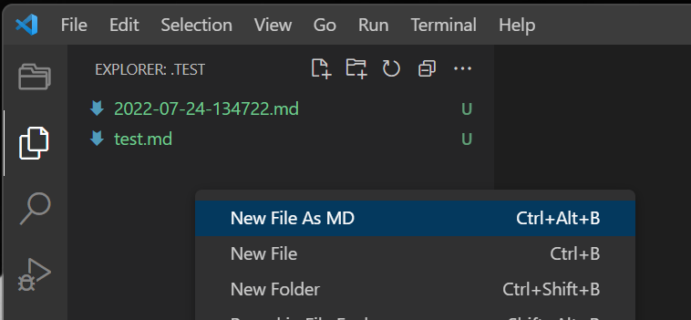
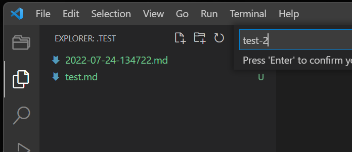
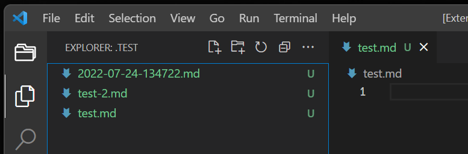

# New File As Md

## how to use

in Explorer, select folder and right click.

type filename to InputBox, rule is next.

+ ""
  + yyyy-mm-dd-hhmmss.md
+ "."
  + .md
+ ".-"
  + .-
+ "-"
  + -.md
+ "-.-"
  + -.-
+ ".."
  + yyyy-mm-dd-hhmmss.md
+ "..-"
  + yyyy-mm-dd-hhmmss.-

### images

# TODO
+ オプション
+ フォルダに対応
+ ..のバグ対応

vsc-extensionのリポジトリは独立させる！
